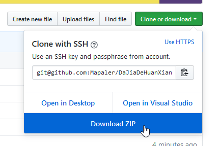
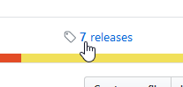

# 大家的幻想乡-皮肤图鉴

## 在线查看（保持最新版本）
https://mapaler.github.io/DaJiaDeHuanXiangXiang-Skin/  
https://mapaler.gitee.io/dajiadehuanxiangxiang-skin/ (国内镜像，查看图片速度会快些，但是我可能会忘记更新)

## 百度贴吧
[大家的幻想乡吧](http://tieba.baidu.com/f?kw=%E5%A4%A7%E5%AE%B6%E7%9A%84%E5%B9%BB%E6%83%B3%E4%B9%A1)

## License|许可协议
大家的幻想乡-皮肤图鉴 Copyright(C) 2017 by 枫谷剑仙

此程序是免费软件。你可以将它根据“GNU通用公共许可证第三版(GPLv3)”重新分发和/或修改。

网页程序代码部分版权属于枫谷剑仙，皮肤图片及皮肤文本版权归属《[大家的幻想乡](http://www.touhou.ren/)》。

## 离线查看办法
希望节省流量的话可以将本项目下载下来离线查看。

### 浏览器要求
火狐68.0及以后需要在`about:config`设定`privacy.file_unique_origin`为`false`。

### 下载最新版本
* #### 会Git  
  克隆，你懂的 :smirk:

* #### 不会Git  
  点击本项目首页的克隆和下载（绿色按钮，往上翻到页面顶部就能看到），然后点击下载ZIP文件按钮  
    
  下载完成解压后用火狐浏览器打开index.html文件即可

### 查看过去的版本
*因为本项目是从1.0.1.5b才开始做的，所以最老的版本是1.0.1.5，并且老版本代码已经不会变化，因此无法添加新版图鉴加入的一些新功能。*

* #### 会Git  
  切换/检出，你懂的 :smirk:

* #### 不会Git  
  点击本项目首页的发布页面(releases)，然后点击下载老版本的ZIP文件  
  

## 后期维护
[如何更新版本数据](Update.md)