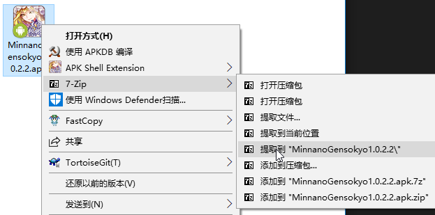
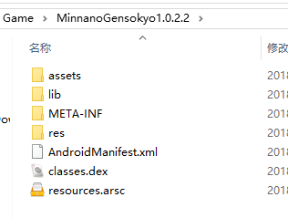
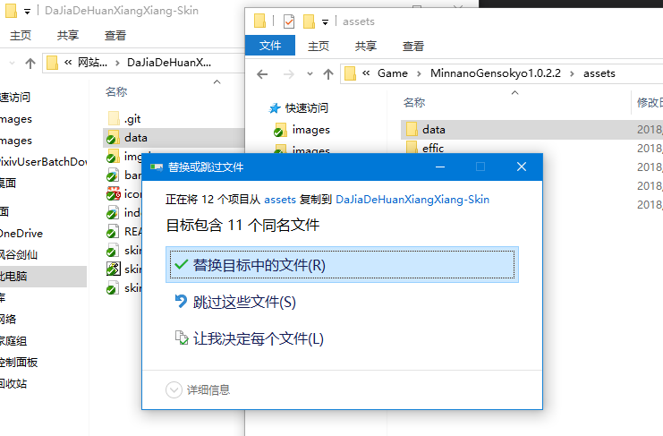
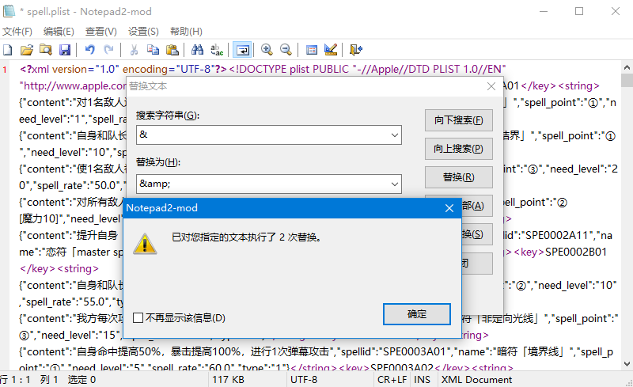
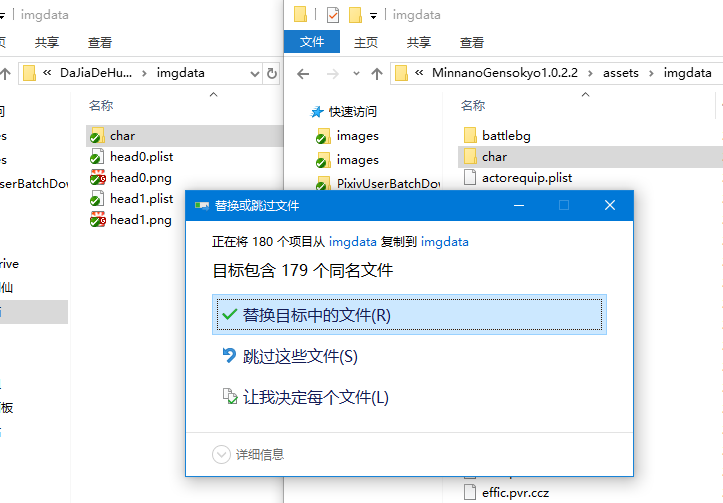
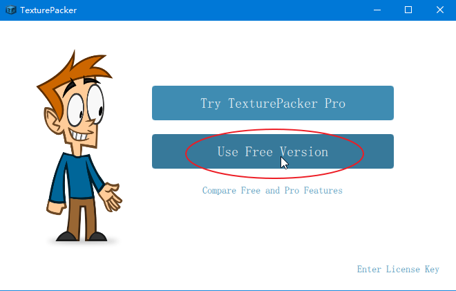
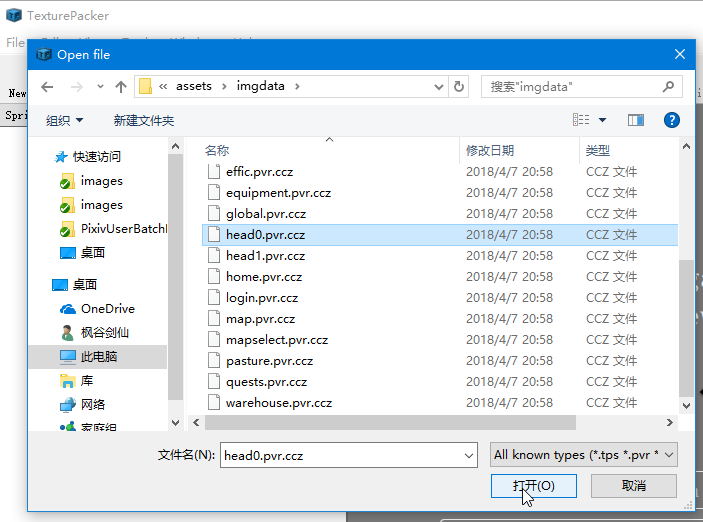
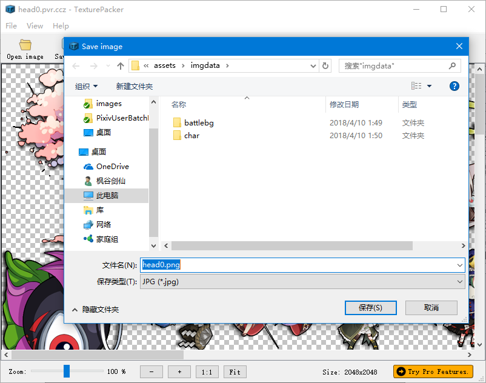
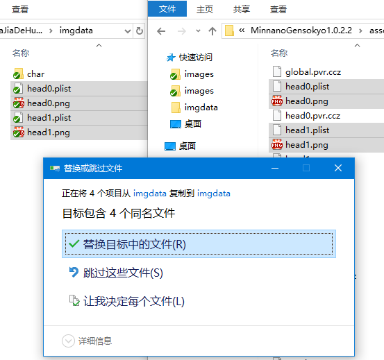
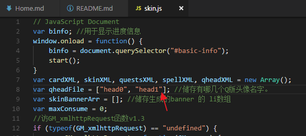

# 如何维护大家的幻想乡-皮肤图鉴
如果那一天我不再继续维护这个项目了，接手的人可以这样更新数据。

## 事先准备
1. 下载apk安装包。
1. 用任意压缩软件解压到一个文件夹。  
    
  

## 更新文字数据
1. 复制`游戏目录\assets\data`文件夹，替换图鉴内的`data`文件夹。  
  
1. 打开`spell.plist`，搜索替换全部`&`为`&amp;`，并保存。  
    
  此步骤是为了让文本符合XML规则，否则网页程序会读取出错，`&`字符在XML内是转义字符，要表示其本身应该使用`&amp;`。

## 更新立绘
1. 复制`游戏目录\assets\imgdata\char`文件夹，替换图鉴内的`imgdata\char`文件夹。 
   

## 更新Q版图
1. 下载[TexturePacker](https://www.codeandweb.com/texturepacker)并安装，打开TexturePackerGUI并选择免费版本(Free Version)启动即可。  
   
1. 使用TexturePacker打开`游戏目录\assets\imgdata`内的`head0.pvr.ccz`和`head1.pvr.ccz`。  
   
1. 如果打开文件需要密码，请尝试`D587BE8D6DDE2D596BFD8960B123A40E`，2018年4月10日为止均可使用。  
  此密码为大佬反编译游戏程序所得，如果失效再次获取将会比较困难，请百度“破解TexturePacker加密资源”。
1. 保存为png格式。  
   
1. 复制`head0.plist`、`head0.png`、`head1.plist`、`head1.png`四个文件到图鉴内的`imgdata`文件夹。  
   
1. 如果`head`文件增加了，比如`head2`。除了相应的增加转换png图片和复制到图鉴内的操作外，还需要修改图鉴程序的`skin.js`文件，搜索`var qheadFile`，并在其后面按格式添加即可。  
   

## 更新文字说明和宴请信息
1. 使用任意网页编辑软件修改`index.html`和`banquet-skin.html`就行，我一般是直接改源代码。