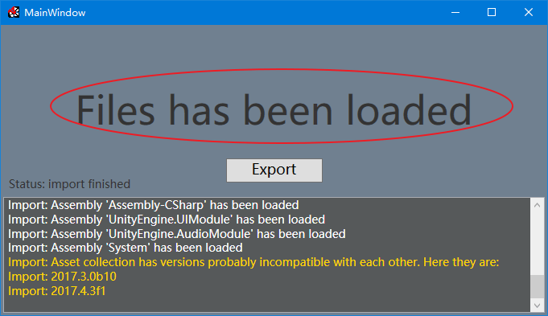
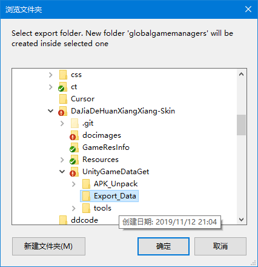

# 如何维护大家的幻想乡-皮肤图鉴
如果那一天我不再继续维护这个项目了，接手的人可以这样更新数据。  
本流程建立于 Windwos 10，使用其他系统的请自行修改。

>更新日期 2019年11月12日 v1.0.2.5使用了Unity3D引擎后的新方法。

## 使用到的工具
|名称|程序文件名|官方网址|作用|
|--|--|--|--|
|7-zip|7z.exe|https://www.7-zip.org/|解包APK(zip压缩)|
|uTinyRipper|uTinyRipper.exe等|https://github.com/mafaca/UtinyRipper|导出Unity3D数据中的资源|
|libwebp|cwebp.exe|https://developers.google.com/speed/webp/docs/precompiled|编码WebP|
|Node.js|node.exe等|https://nodejs.org/|执行本地js脚本|
### 工具的准备
* 将`7z.exe`放到`UnityGameDataGet\tools`文件夹当中
* 将`uTinyRipper`整体解包到`UnityGameDataGet\tools\uTinyRipper`文件夹当中
* 将`cwebp.exe`放到`UnityGameDataGet\tools`文件夹当中
* 安装 **Node.js**（也可使用解压版，需自行修改node的路径）

# 更新流程
1. 下载apk安装包，并放到`UnityGameDataGet`文件夹当中。
1. 执行[1.解包APK资源.bat](UnityGameDataGet\1.解包APK资源.bat)，并等待`uTinyRipper`弹出。
1. 等待`uTinyRipper`将所有文件加载完成后，点击`Export`将数据导出到`UnityGameDataGet\Export_Data`文件夹。
   >uTinyRipper加载完成时会显示`Files has been loaded`  
   >
   
   >请将数据导出到`UnityGameDataGet\Export_Data`  
   >
1. 执行[2.复制图片资源.bat](UnityGameDataGet\2.复制图片资源.bat)，将所有图片复制到网页数据路径（默认不会覆盖已有的文件），并且脚本会自动将文件名的小写转换为大写（扩展名仍为小写）。
1. 执行[3.png转WebP.bat](UnityGameDataGet\3.png转WebP.bat)，将所有网页使用的图片转换为 WebP 格式（默认不会覆盖已有的文件）。
1. 执行[4.获取在线游戏数据.bat](UnityGameDataGet\4.获取在线游戏数据.bat)，获取所有卡片、皮肤的数据。

## 更新文字说明和宴请信息
使用任意网页编辑软件修改`index.html`和`banquet-skin.html`就行，我一般是直接改源代码。
